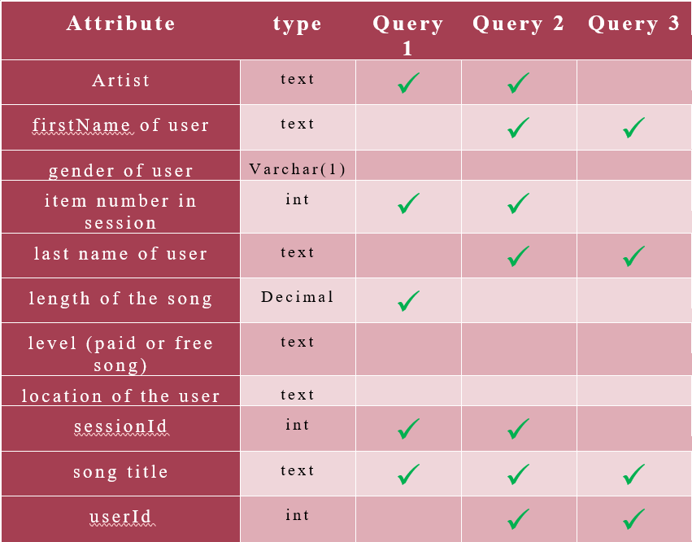
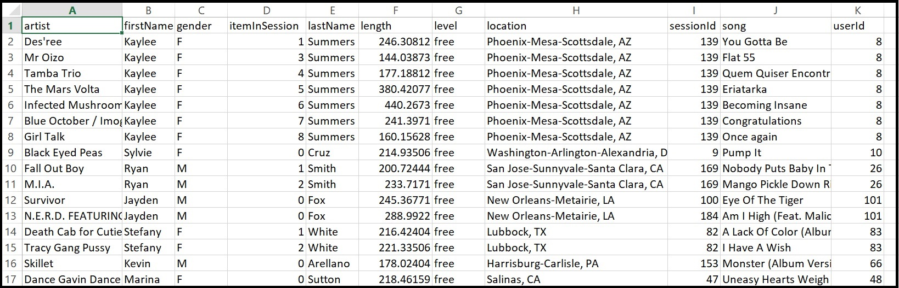

# Project 1B: Data Modeling with Apache Cassandra 
.png)
This project was provided as part of Udacity's Data Engineering Nanodegree program, you can [see all the Nano Degree projects from here](https://github.com/mohamedbakhet/Data-Engineering-Udacity-Nano-Degree-Program-).
## Introduction
---
A startup called Sparkify wants to analyze the data they've been collecting on songs and user activity on their new music streaming app. The analysis team is particularly interested in understanding what songs users are listening to. Currently, there is no easy way to query the data to generate the results, since the data reside in a directory of CSV files on user activity on the app.

They'd like a __data engineer__ to create an Apache Cassandra database which can create queries on song play data to answer the questions, and wish to bring you on the project. Your role is to create a database for this analysis. You'll be able to test your database by running queries given to you by the analytics team from Sparkify to create the results.

## Project Description
---
the goal from project is build data modeling using **apache cassandra** and build ETL pipeline, througth build and create **apache cassandra database** and deal with csv files to preprossecing them and insert them into **cassandra database** it created in previous step and build **cassandra database** to optimize this there Queries.
after merge csv files to large csv file ,build cassandra table to optimize the next Queries and in next figure show the attributes needed on each query



### Query 1

to optimize this query ,build **song_info_by_session** cassandra table

```
Table Name: song_info_by_session
column 1: artist           text
column 2: song             text
column 3: length           decimal
Column 4: sessionid        int
Column 5: itemlnsession    int
PRIMARY KEY(sessionid, itemlnsession)
```
sessionid is a partition key and itemlnsession is cluster key
---

### Query 2

to optimize this query ,build **song_playing_history_by_user** cassandra table

 ```
 Table Name: song_playing_history_by_user
column 1: artist           text
column 2: song             text
column 3: first_name       text
column 4: last_name        text
Column 5: sessionid        int
Column 6: itemlnsession    int
Column 7: userid           int
PRIMARY KEY((userid,sessionid), itemlnsession)
```


userid and sessionid are composed partition key and itemlnsession is cluster key (it used as cluster key to order the song order descending with itemlnsession)

---
### Query 3

to optimize this query ,build **who_listen_to_song** cassandra table

  ```
  Table Name: who_listen_to_song
Column 1: userid           int
column 2: first_name       text
column 3: last_name        text
column 4: song             text
PRIMARY KEY( song ,user_id)
```
song is partition key and userid is cluster key
---
## Dataset 
 working with event_data dataset,it contaion 30 file contains the history of music streaming app.  
  The directory of CSV files partitioned by date. Here are examples of filepaths to two files in the dataset: 


  

## Usage 

---
1. prepare Environment  install python 
2. install Apache cassandra you can view  [Cassandra Documentation](https://cassandra.apache.org/doc/latest/cassandra/getting_started/installing.html) to install it 
3. run ``Project_1B_ Project_Template.ipynb``  using  **jupyter notebook** or any notebook editor 
4. don't forget to close any connection opening 

## Files
---
### (folder) even_data
This folder contains a collection of csv files. each file is contain information about history of music streaming app in day.

### (folder) images
This folder contains some images they were used in this repository to illustrate some thang.


### Project_1B_ Project_Template.ipynb
A Python Jupyter Notebook that was used to reads and processes a data and collect them on one file,same EDA and detailed instructions on the ETL and create and deal with cassandra database.


## Libreries and tools 
---
### tools

>* juputer notebook 
>* python 
>* Apache cassandra
>* text editor

### python package
>1. panads
>2. cassandra drive
>3. os
>4. csv 


## About me
---
I'm mohamed bekheet, you con browser other repository on my [github profile](https://github.com/mohamedbakhet) and view my [linkedin page](https://www.linkedin.com/in/mohamedbekheet-/) and [kaggle profile](https://www.kaggle.com/mohamedbakhet) and you can contect with me throgth mohamedbekheet33@gmail.com